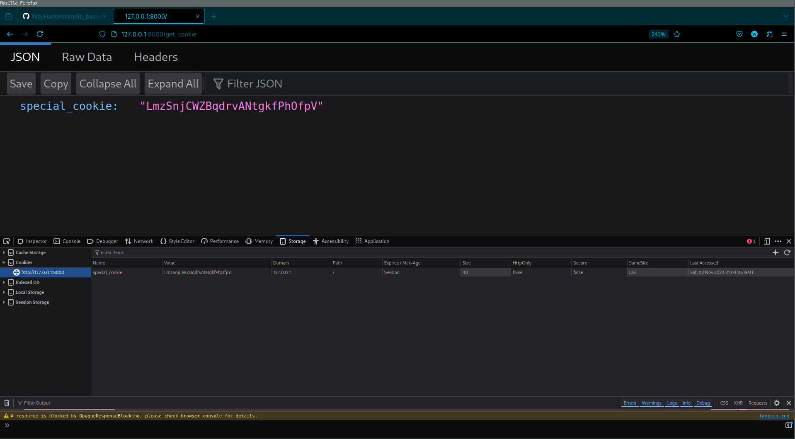

## About
Simple backend with fast api.
Two api calls first set up Cookies on frontend side, second call returns that Cookies.

### Quick start
#### Install requirements
<code>
pip install -r requirements.txt
</code>

#### Run local host

<code>
make run
</code>

### Api routes
1. **/set_cookies** - set up cookie with random sequense 
2. **/get_cookies** - get value of cookie 